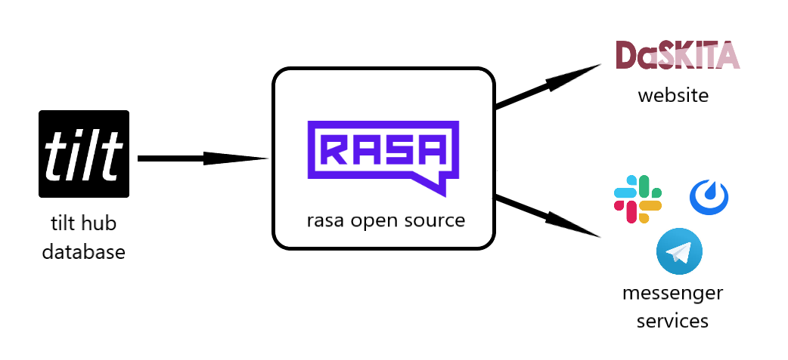
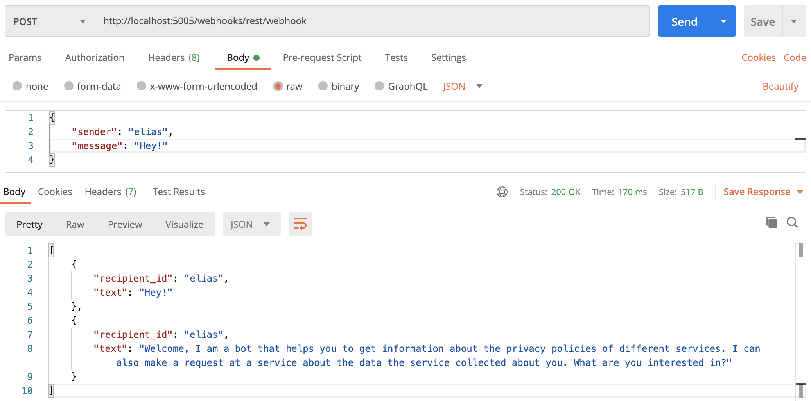

# Chatbot
Entwicklung eines Chatbots, mit dem NutzerInnen kommunizieren können (als NutzerInnenschnittstelle zu tilt-Dokumenten).

Mögliche Anwendungen: 
1.	AP2 Transparenz: 
NutzerInnen können (Teile der) Transparenzinformationen (aus tilt Dokumenten) abfragen/angeboten bekommen 

2.	AP3 Auskunft: 
  a)	NutzerInnen kännen angeben, welche Infos sie bei einem Dienst anfragen wollen (in tilt steht, welche Daten gesammelt werden -> werden von Chatbot „angeboten“) 
			-> (E-Mail) Anfrage wird automatisch generiert      
  b)	Abfragen bei NutzerInnen, ob und welche Informationen gelöscht werden sollen -> (E-Mail) Löschanfrage wird automatisch generiert
  ->	Brücke zu unterstützten Auskunftsanfragen

(weitere Anwendungen möglich)

Der Chatbot ist mit Rasa Open Source programmiert. Er nutzt tilt-hub als Datenbank, um tilt-Dokumente auszulesen. Ausgespielt wird der Bot über eine Website und Messenger-Dienste.

## Setup 

- Sicherstellen, dass alle Dokumente im tilt hub abrufbar sind: `python preprocessing.py`
- Neues Modell trainieren: `rasa train`
- Modell testen: Action Server starten mittels `rasa run actions` und `rasa shell` oder `rasa shell --debug`

## Webinterface
- Action Server starten mittels `rasa run actions` und `rasa run -m models --enable-api --cors "*" --debug`

## REST API

## Telegram
1. 	https version der Website erstellen: z.B. 'ngrok http 5005'
2.	In credentials.yml bei webhook the https url einfügen
3.	Action server und rasa starten: 'rasa run actions' und 'rasa run -m models --enable-api --connector telegram --cors "*" --debug --credentials credentials.yml'
4. 	in telegram "daskita_bot" suchen und Konversation starten

## Alexa
1.	https version der Website erstellen: z.B. 'ngrok http 5005'
2.	Action server und rasa starten: 'rasa run actions' und 'rasa run -m models --enable-api --connector alexa_connector.AlexaConnector --cors "*" --debug --credentials credentials.yml'
3.	auf der Amazon Alexa developer page: den endpoint mit der https url + '/webhooks/alexa_assistant/webhook' anpassen
4.	auf der Amazon Alexa developer page: Build klicken
5.	Konversation starten mit: 'Alexa, start privacy bot'
